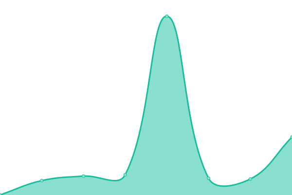
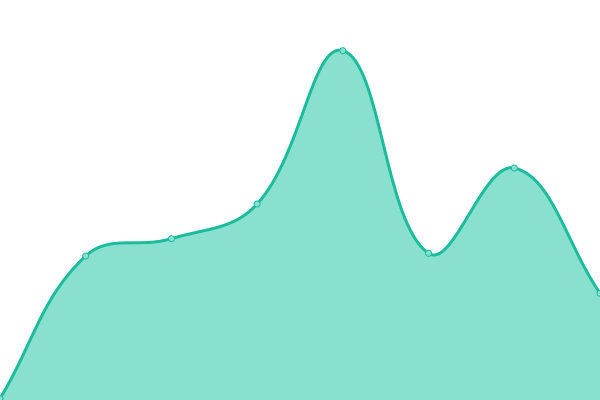

# [📈 Live Status](https://jparga.github.io/upptime): <!--live status--> **🟩 All systems operational**

This repository contains the open-source uptime monitor and status page for [Jacinto Parga](https://jparga.github.io/upptime), powered by [Upptime](https://github.com/upptime/upptime).

With [Upptime](https://upptime.js.org), you can get your own unlimited and free uptime monitor and status page, powered entirely by a GitHub repository. We use [Issues](https://github.com/jparga/upptime/issues) as incident reports, [Actions](https://github.com/jparga/upptime/actions) as uptime monitors, and [Pages](https://jparga.github.io/upptime) for the status page.

<!--start: status pages-->
<!-- This summary is generated by Upptime (https://github.com/upptime/upptime) -->
<!-- Do not edit this manually, your changes will be overwritten -->
<!-- prettier-ignore -->
| URL | Status | History | Response Time | Uptime |
| --- | ------ | ------- | ------------- | ------ |
|  [MEREBA](https://www.mereba.com) | 🟩 Up | [mereba.yml](https://github.com/jparga/upptime/commits/HEAD/history/mereba.yml) | 

 466ms
     
 | 

<a href="https://jparga.github.io/upptime/history/mereba">100.00%</a>
    

|  [Test Mereba](https://mereba.com.es) | 🟩 Up | [test-mereba.yml](https://github.com/jparga/upptime/commits/HEAD/history/test-mereba.yml) | 

 907ms
     
 | 

<a href="https://jparga.github.io/upptime/history/test-mereba">100.00%</a>
    

|  [Marca Franca](https://marcafranca.com) | 🟩 Up | [marca-franca.yml](https://github.com/jparga/upptime/commits/HEAD/history/marca-franca.yml) | 

 614ms
     
 | 

<a href="https://jparga.github.io/upptime/history/marca-franca">100.00%</a>
    

|  [Canal Responsable Web](https://canalresponsable.com) | 🟩 Up | [canal-responsable-web.yml](https://github.com/jparga/upptime/commits/HEAD/history/canal-responsable-web.yml) | 

 596ms
     
 | 

<a href="https://jparga.github.io/upptime/history/canal-responsable-web">100.00%</a>
    

|  [MFREG](https://mfreg.marcafranca.com/robots.txt) | 🟩 Up | [mfreg.yml](https://github.com/jparga/upptime/commits/HEAD/history/mfreg.yml) | 

 212ms
     
 | 

<a href="https://jparga.github.io/upptime/history/mfreg">100.00%</a>
    

|  [Atletismo máster](https://atletismomaster.es) | 🟩 Up | [atletismo-master.yml](https://github.com/jparga/upptime/commits/HEAD/history/atletismo-master.yml) | 

 719ms
     
 | 

<a href="https://jparga.github.io/upptime/history/atletismo-master">97.59%</a>
    

|  [Parga Asociados](https://pargaasociados.es) | 🟩 Up | [parga-asociados.yml](https://github.com/jparga/upptime/commits/HEAD/history/parga-asociados.yml) | 

 817ms
     
 | 

<a href="https://jparga.github.io/upptime/history/parga-asociados">100.00%</a>
    

|  Site CR OP | 🟩 Up | [site-cr-op.yml](https://github.com/jparga/upptime/commits/HEAD/history/site-cr-op.yml) | 

 267ms
     
 | 

<a href="https://jparga.github.io/upptime/history/site-cr-op">100.00%</a>
    

|  Site DIBA CL | 🟩 Up | [site-diba-cl.yml](https://github.com/jparga/upptime/commits/HEAD/history/site-diba-cl.yml) | 

 782ms
     
 | 

<a href="https://jparga.github.io/upptime/history/site-diba-cl">98.38%</a>
    

<!--end: status pages-->

[**Visit our status website →**](https://jparga.github.io/upptime)

## 📄 License

- Powered by: [Upptime](https://github.com/upptime/upptime)
- Code: [MIT](./LICENSE) © [Anand Chowdhary](https://anandchowdhary.com), supported by [Pabio](https://pabio.com)
- Data in the `./history` directory: [Open Database License](https://opendatacommons.org/licenses/odbl/1-0/)
